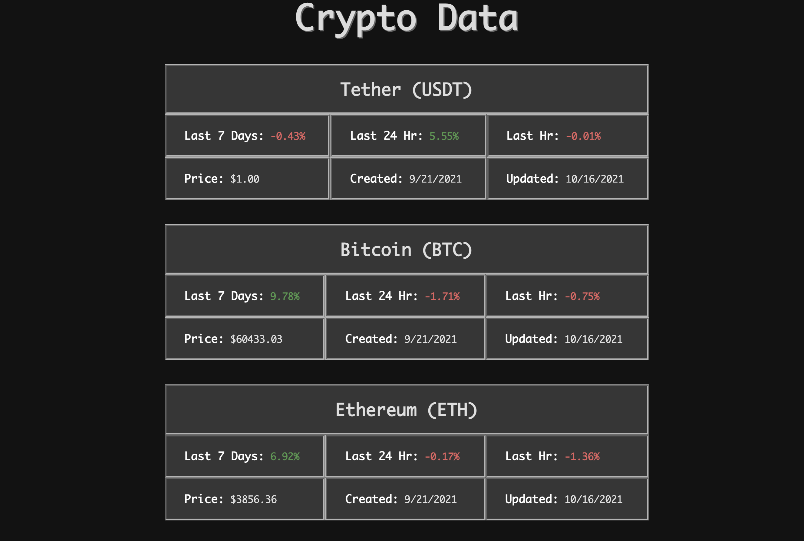

# Simple Crypto Data Displayer

Displays data on various cryptocurrencies. 

The only functionality is to go to next and previous pages of cryptocurrencies.

Red text indicates a decrease in price. 

Green text indicates an increase in price.

Created using React.js and the CrytpingUp API

## To Run:
`$ npm install`

`$ npm start`

## Resources:
[CryptingUp API Docs](https://www.cryptingup.com/apidoc/#introduction)